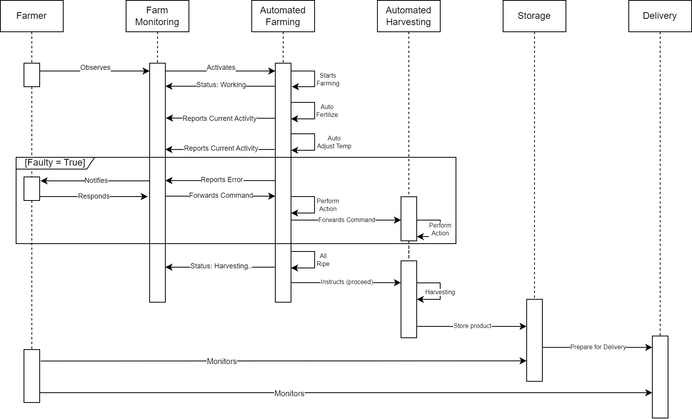
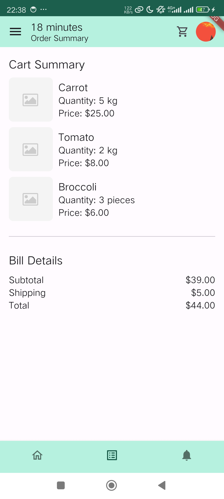

# UrbanGreenNest

 
A brief description of the project revolving its technological (architecture) side.

## Sequence Diagram

The image above essentially conveys how would the urban farming project works. Basically the farmer (owner) will only monitor the automated processes being done as well as when it is delivering to the consumers from the app.

## Architectures
  
Our 'scratch-paper' Database architecture across the platforms. The most important part is that there will and should be databases to aggregate the other databases for necessary consumers and farmers needs such as product stocks (available for purchase), sold products (seeing the trend), distribution and other relevant information/data for both the farmers and consumers.

### Database (ERD)
  
This is just the scratches of the ERD. Obviously it is far from the requirements for the project. Therefore, further study and analysis is needed.

## Technologies & Prototypes
### Monitoring Camera (Tensorflow)
The technology the monitor the growth of the plants can be implemented through Tensorflow. The idea is that the algorithm will watch over the plants in real-time to ensure its growth going successfully without diseases and sorts. Any abnormalities detected will be reported and the robots will perform appropriate actions to the situation.    
To depict the camera algorithm, we did image classification:

  
It can be seen that the model's accuracy is shockingly reaching 100% with fluctuations (no overfitting). However, it can be influeced by the dataset that is chosen is relatively simple.  
Ultimately, few sample pictures taken from Google are used to witness the prediction result:

 
Additionally, the procedure of the camera monitoring system will approximately be like so:

### Monitoring Software
We created the monitoring software to be web-based just to basically illustrate how it looks.

Of course the login won't exactly like this. It should be more complex system to avoid data breach. Just an example there.

This is the real deal. The monitoring software UI will approximately look like that. It is quite simple and informative for the farmers to receive essential information regarding the farm itself and the market.

### Firebase (as Database)
The idea of using Firebase is to be able to utilize its feature of real-time database. Our project will implement real-time monitoring system for the farm. Since we're making prototypes, at the moment we are not utilizing the real-time database yet. Just the normal one with dummy data.

### Android (Consumer app)
Our E-commerce app will be like the usual shopping apps which will be on mobile in the beginning. It will approximately look like this:

Other UI are also created such as the product overview and cart summary:

 
We obviously also want to implement 2FA for better security measurement:

